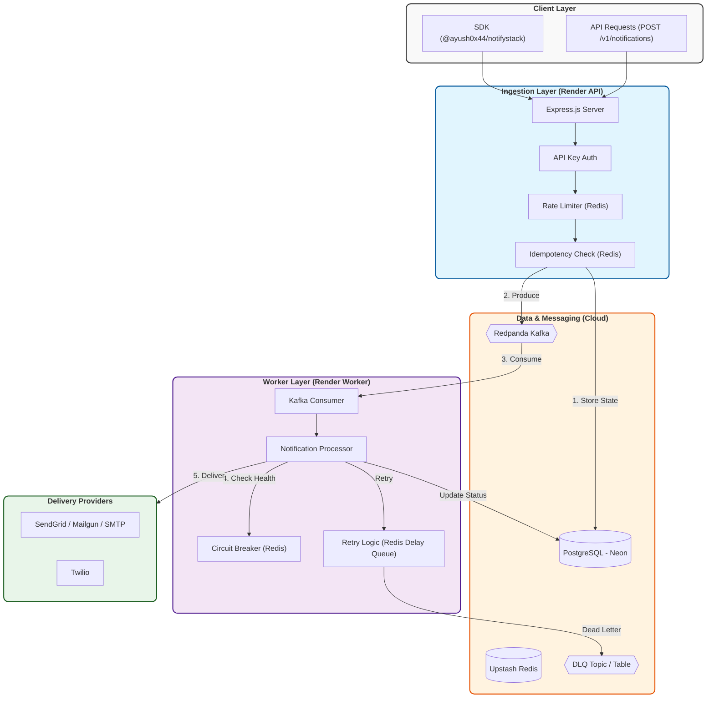

# 🔔 NotifyStack — System Architecture

*A high-throughput, multi-channel notification engine built on modern distributed patterns.*

## 🏗️ Architecture Overview

The system is designed for high-availability and reliability, using **Kafka** for decoupling processing, **Redis** for rate-limiting and circuit-breaking, and **PostgreSQL** as the unified source of truth for notification status.

---

*For detailed internal documentation, see [ARCHITECTURE.md](ARCHITECTURE.md).*
